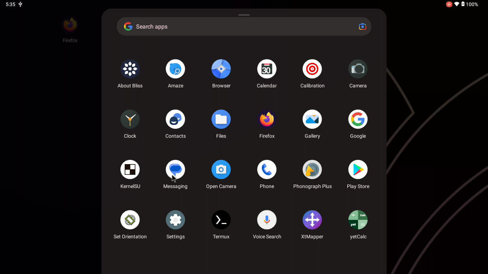

+++
date = '2025-08-17T11:48:21+01:00'
draft = false
title = 'Manual Installation of Bliss Os on Linux'
categories =["tutorial","Os"]
tags=['BlissOs','Android']
+++

# Manual Install of  Bliss os  on  Linux


Bliss os  is  strong  Android x86 operating system designed to run on PCs.But many users do't know how to install it .they struggle with  steps of  installation ,or even deciding between Versions.

This tutorial walks you through installing Bliss os frome scratch .specifically Manaual installation on linux I'll cover every step from downloading the right ISO to configuring Grub.

With tested steps ,you'll get Bliss OS  up and running smoothly on your Linux PC .


**Warning!** not all app's you install on bliss os will work smoothly ? 



### Dowload the  iso 

1. Go to this website [BlissOS-x86](https://sourceforge.net/projects/blissos-x86/files/Official/)

#### The Right Bliss ISO you need .
1. **BlissOS16**  
   - **Android Version:** 14 (Upside Down Cake)  
   - *Note: BlissOS 16.x is built on Android 14 (API level 34).*

2. **BlissOSZenith**  
   - **Android Version:** 10 (Q)  
   - *Note: BlissOS Zenith is a specialized edition based on Android 10 (API level 29).*

3. **BlissOS14**  
   - **Android Version:** 12 (Snow Cone)  
   - *Note: BlissOS 14.x uses Android 12 (API level 31).*

4. **BlissOS15**  
   - **Android Version:** 13 (Tiramisu)  
   - *Note: BlissOS 15.x is derived from Android 13 (API level 33).*

| **Feature**            | **GApps Variant**                   | **FOSS Variant**                             |
| ---------------------- | ----------------------------------- | -------------------------------------------- |
| **Google Play Store**  | ✅ Pre-installed                     | ❌ Not included                               |
| **Google Services**    | ✅ (Play Services, etc.)             | ❌                                            |
| **Open-Source Focus**  | ❌ (Includes proprietary apps)       | ✅ (Only FOSS apps)                           |
| **Alternative Stores** | ❌ (Play Store is primary)           | ✅ (F-Droid, Aurora Store preinstalled/setup) |
| **MicroG Integration** | ❌                                   | ⚠️ Optional or user-installed                |
| **Privacy**            | 🔻 Lower (Google telemetry present) | 🔺 Higher (No Google tracking)               |


###  GApps (Google Play Services)
**Includes:**  
- Google Play Store, Gmail, YouTube, Maps, Drive, etc.  
- Google Mobile Services (GMS) for app compatibility.  
- Required for apps that depend on Google APIs (e.g., banking apps, games).  

**Best for:**  
- Users needing full Android app compatibility.  
- Those reliant on Google ecosystem services.  

**Download:**  
- Look for builds labeled **`GApps`**, **`with GMS`**, or **`Google Play`** in the filename.  
  Example: `BlissOS-16-x86_64-GApps-*.iso`  

---

###  FOSS (No Google Services)
**Includes:**  
- **No proprietary Google apps/services.**  
- Open-source alternatives:  
  - **App Stores:** [F-Droid](https://f-droid.org/), [Aurora Store](https://auroraoss.com/).  
  - **MicroG:** Lightweight Google Services replacement (optional).  
  - Privacy-focused apps (e.g., NewPipe instead of YouTube).  

**Best for:**  
- Privacy-focused users.  
- Devices with limited resources (lighter OS).  
- Avoiding Google telemetry.  

**Download:**  
- Look for builds labeled **`FOSS`**, **`without GApps`**, or **`vanilla`**.  
  Example: `BlissOS-16-x86_64-FOSS-*.iso` 

In my step-by-Step Guide  I will use "GApps" ,and "Bliss-v16.9.4-x86_64-OFFICIAL-gapps-20240220.iso"

###  Installation
  
  After  dowloading  what you need we dive to installation

####  requirements 

`A Linux system`
`4 GB Ram`
`grub` 

1. Create a directory at / as /blissos 
2. Extract `7z x Bliss-v16.9.4-x86_64-OFFICIAL-gapps-20240220.iso`  . and copy  initrd.img, ramdisk.img, kernel  to /blissos   
3. Create a directory called /blissos/data. This will only work for ext4 filesystems, for NTFS and other filesystems or if you are having bootloop you need data.img, can be created with make_ext4fs.

```

mkdir /blissos/data
cd data
dd if=/dev/zero of=data.img bs=1 count=0 seek=8G
sudo mkfs.ext4 -F data.img 

```
4. Create a new grub entry with this the following code
(add the following  code  to /etc/grub.d/40_custom )

```
#!/bin/sh
exec tail -n +3 $0
# This file provides an easy way to add custom menu entries.  Simply type the
# menu entries you want to add after this comment.  Be careful not to change
# the 'exec tail' line above.

menuentry "BlissOS (Default) w/ FFMPEG" {
    set SOURCE_NAME="blissos"
    search --set=root --file /$SOURCE_NAME/kernel
    linux /$SOURCE_NAME/kernel FFMPEG_CODEC=1 FFMPEG_PREFER_C2=1 quiet root=/dev/ram0 SRC=/$SOURCE_NAME
    initrd /$SOURCE_NAME/initrd.img
}

menuentry "BlissOS (Intel) w/ FFMPEG" {
    set SOURCE_NAME="blissos"
    search --set=root --file /$SOURCE_NAME/kernel
    linux /$SOURCE_NAME/kernel HWC=drm_minigbm_celadon GRALLOC=minigbm FFMPEG_CODEC=1 FFMPEG_PREFER_C2=1 quiet root=/dev/ram0 SRC=/$SOURCE_NAME
    initrd /$SOURCE_NAME/initrd.img
}

menuentry "BlissOS PC-Mode (Default) w/ FFMPEG" {
    set SOURCE_NAME="blissos"
    search --set=root --file /$SOURCE_NAME/kernel
    linux /$SOURCE_NAME/kernel  quiet root=/dev/ram0 SRC=/$SOURCE_NAME
    initrd /$SOURCE_NAME/initrd.img
}

menuentry "BlissOS PC-Mode (Intel) w/ FFMPEG" {
    set SOURCE_NAME="blissos"
    search --set=root --file /$SOURCE_NAME/kernel
    linux /$SOURCE_NAME/kernel PC_MODE=1 HWC=drm_minigbm_celadon GRALLOC=minigbm FFMPEG_CODEC=1 FFMPEG_PREFER_C2=1 quiet root=/dev/ram0 SRC=/$SOURCE_NAME
    initrd /$SOURCE_NAME/initrd.img
}
```
4. Update grub 
```
update-grub
```
5. Reboot your system using 
```
sudo reboot 

```
new chose well appear in the grub menu choose the bliss os and set up you android system if you have use Gapp


