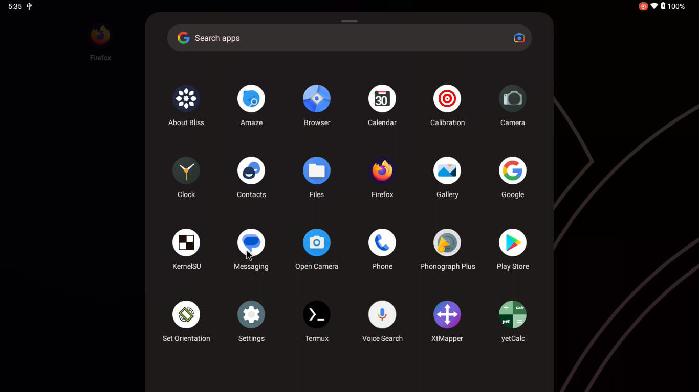

+++
title = "Install Bliss OS on Linux: Step-by-Step GRUB Guide (2025)"
date = "2025-08-17T11:48:21+01:00"
lastmod = "2026-07-21"
draft = false
description = "Run Android on your Linux PC with Bliss OS. This guide covers ISO download, GRUB setup, data partition creation, and troubleshooting — tested on x86_64."
summary = "Manual installation guide for Bliss OS on Linux. Covers ISO download, GRUB configuration, data partition setup, kernel boot parameters, and common troubleshooting steps."
slug = "install-bliss-os-linux"
robots = "index, follow"
categories = ["Mobile", "Android","Linux"]
tags = ["blissos","android-x86"]
keywords = ["bliss os install linux", "bliss os grub manual install", "android x86 linux grub boot", "bliss os without usb linux", "android on pc linux"]
+++


## Manual Installation of Bliss OS on Linux



> ⏱ **Estimated time:** ~20 minutes | 🔧 **Difficulty:** Intermediate | ✅ **Tested on:** Ubuntu, Void Linux (x86_64)

### What is Bliss OS?

Bliss OS is a powerful Android x86 operating system designed to run natively on PCs and laptops. Unlike an emulator such as Android Studio AVD or Genymotion, Bliss OS boots directly from your GRUB menu and runs Android on bare metal — giving you full hardware performance without virtualization overhead.

It is built on top of the Android-x86 project and maintained by the BlissROM team. You can use it to run Android apps directly on your Linux PC, test apps in a real Android environment, or just experience Android on desktop hardware.

**Why install Bliss OS manually instead of using a USB?**
The USB installer method creates a separate boot partition. The manual GRUB method covered here is cleaner for Linux users: you extract the ISO to a directory on your existing filesystem and add a GRUB entry — no repartitioning, no USB drive needed.


**Warning:** Not all apps you install on Bliss OS will work smoothly. Apps that rely heavily on sensors (GPS, gyroscope) or Widevine DRM (Netflix, Disney+) may not function correctly.


---

## Step 1 — Download the ISO

Go to the official download page: [BlissOS-x86 on SourceForge](https://sourceforge.net/projects/blissos-x86/files/Official/)

### Choosing the Right Bliss OS Version

Bliss OS releases are tied to Android versions. Here is a quick reference:

| Version | Android Version | API Level |
|---|---|---|
| **BlissOS 16** | Android 14 (Upside Down Cake) | 34 |
| **BlissOS 15** | Android 13 (Tiramisu) | 33 |
| **BlissOS 14** | Android 12 (Snow Cone) | 31 |
| **BlissOS Zenith** | Android 10 (Q) | 29 |

**Recommended:** BlissOS 16 (Android 14) unless you need a specific API level for app compatibility.

### GApps vs FOSS — Which Variant to Download?

| Feature | GApps Variant | FOSS Variant |
|---|---|---|
| **Google Play Store** | ✅ Pre-installed | ❌ Not included |
| **Google Services** | ✅ Play Services, GMS | ❌ |
| **Open-Source Focus** | ❌ Includes proprietary apps | ✅ FOSS apps only |
| **Alternative Stores** | ❌ Play Store is primary | ✅ F-Droid, Aurora Store |
| **MicroG Support** | ❌ | ⚠️ Optional / user-installed |
| **Privacy** | 🔻 Lower (Google telemetry) | 🔺 Higher (no tracking) |

#### GApps Variant
Includes Google Play Store, Gmail, YouTube, Maps, Drive, and Google Mobile Services (GMS). Required for apps that depend on Google APIs such as banking apps and most games.

**Best for:** Users who need full Android app compatibility and rely on the Google ecosystem.

Look for filenames labeled `GApps`, `with GMS`, or `Google Play`.
Example: `BlissOS-16-x86_64-GApps-*.iso`

#### FOSS Variant
Ships with no proprietary Google apps. Comes with open-source alternatives: [F-Droid](https://f-droid.org/) and [Aurora Store](https://auroraoss.com/) as app stores, and optionally MicroG as a lightweight Google Services replacement.

**Best for:** Privacy-focused users and devices with limited resources.

Look for filenames labeled `FOSS`, `without GApps`, or `vanilla`.
Example: `BlissOS-16-x86_64-FOSS-*.iso`

---

For this guide I use the GApps variant: `Bliss-v16.9.4-x86_64-OFFICIAL-gapps-20240220.iso`

---

## Step 2 — Requirements

Before starting, make sure you have:

- A Linux system with **x86_64** architecture
- At least **4 GB of RAM** (8 GB recommended for a smooth experience)
- **GRUB** as your bootloader (GRUB 2)
- **p7zip** installed (`sudo apt install p7zip-full` on Debian/Ubuntu, `sudo xbps-install p7zip` on Void Linux)
- The root partition formatted as **ext4** (see the note on NTFS in Step 3)

---

## Step 3 — Extract the ISO and Set Up the Directory

**1. Create the Bliss OS directory at the root of your filesystem:**

```bash
sudo mkdir /blissos
```

**2. Extract the ISO using 7z:**

```bash
7z x Bliss-v16.9.4-x86_64-OFFICIAL-gapps-20240220.iso
```

**3. Copy the boot files to /blissos:**

```bash
sudo cp initrd.img  kernel system.efs /blissos/
```

These three files are what GRUB needs to boot Bliss OS:
- `kernel` — the Android-x86 Linux kernel
- `initrd.img` — the initial RAM disk that loads the Android environment
-  `system.efs`  —  essentially the Android system partition image
**4. Create the data directory and generate the data image:**

```bash
sudo mkdir /blissos/data
cd /blissos/data
sudo dd if=/dev/zero of=data.img bs=1 count=0 seek=8G
sudo mkfs.ext4 -F data.img
```

The `data.img` file acts as Android's internal storage — it stores your apps, settings, and user data. The `dd` command creates a sparse 8 GB file without actually writing 8 GB to disk.

> **Note on NTFS / non-ext4 filesystems:** The `/blissos/data` directory approach only works on ext4 partitions. If your root filesystem is NTFS, btrfs, or you are experiencing a boot loop, you must use the `data.img` method shown above instead of a bare directory.

---

## Step 4 — Add the GRUB Menu Entry

Open `/etc/grub.d/40_custom` with a text editor as root:

```bash
sudo nano /etc/grub.d/40_custom
```

Add the following entries at the bottom of the file:

```
menuentry "BlissOS (Default) w/ FFMPEG" {
    set SOURCE_NAME="blissos"
    search --set=root --file /$SOURCE_NAME/kernel
    linux /$SOURCE_NAME/kernel FFMPEG_CODEC=1 FFMPEG_PREFER_C2=1 quiet root=/dev/ram0 SRC=/$SOURCE_NAME
    initrd /$SOURCE_NAME/initrd.img
}

menuentry "BlissOS (Intel GPU) w/ FFMPEG" {
    set SOURCE_NAME="blissos"
    search --set=root --file /$SOURCE_NAME/kernel
    linux /$SOURCE_NAME/kernel HWC=drm_minigbm_celadon GRALLOC=minigbm FFMPEG_CODEC=1 FFMPEG_PREFER_C2=1 quiet root=/dev/ram0 SRC=/$SOURCE_NAME
    initrd /$SOURCE_NAME/initrd.img
}

menuentry "BlissOS PC-Mode (Default)" {
    set SOURCE_NAME="blissos"
    search --set=root --file /$SOURCE_NAME/kernel
    linux /$SOURCE_NAME/kernel quiet root=/dev/ram0 SRC=/$SOURCE_NAME
    initrd /$SOURCE_NAME/initrd.img
}

menuentry "BlissOS PC-Mode (Intel GPU)" {
    set SOURCE_NAME="blissos"
    search --set=root --file /$SOURCE_NAME/kernel
    linux /$SOURCE_NAME/kernel PC_MODE=1 HWC=drm_minigbm_celadon GRALLOC=minigbm FFMPEG_CODEC=1 FFMPEG_PREFER_C2=1 quiet root=/dev/ram0 SRC=/$SOURCE_NAME
    initrd /$SOURCE_NAME/initrd.img
}
```

### What Do These Kernel Parameters Mean?

| Parameter | What It Does |
|---|---|
| `SRC=/blissos` | Tells Android-x86 where to find its system files |
| `root=/dev/ram0` | Boots Android from RAM (standard for Android-x86) |
| `FFMPEG_CODEC=1` | Enables hardware-accelerated video decoding via FFmpeg |
| `FFMPEG_PREFER_C2=1` | Uses the newer Codec 2.0 API for better media performance |
| `HWC=drm_minigbm_celadon` | Sets the Hardware Composer for Intel GPUs |
| `GRALLOC=minigbm` | Uses the minigbm graphics memory allocator (required for Intel) |
| `PC_MODE=1` | Enables PC-style window management (taskbar, resizable windows) |
| `quiet` | Suppresses kernel boot messages for a cleaner boot screen |

**Which entry should you use?**
- **Default entries** — try these first on AMD/NVIDIA systems or if you are unsure
- **Intel GPU entries** — use these if you have an Intel integrated GPU (most laptops)
- **PC-Mode** — adds a taskbar and resizable app windows, closer to a desktop experience

---

## Step 5 — Update GRUB and Reboot

**Update your GRUB configuration:**

```bash
sudo update-grub
```

You should see a line like `Found BlissOS (Default) w/ FFMPEG` in the output, confirming GRUB detected the new entries.

**Reboot your system:**

```bash
sudo reboot
```

At the GRUB menu, select your preferred Bliss OS entry. The first boot takes 1–2 minutes while Android initializes. You will then go through the standard Android setup wizard. If you chose the GApps variant, sign into your Google account to access the Play Store.

---

## Troubleshooting

### Black screen after selecting Bliss OS in GRUB

- Try the **Intel GPU** entry if you are on Intel integrated graphics
- Add `nomodeset` to the kernel parameters to disable KMS: edit the line starting with `linux` in `40_custom` and append `nomodeset` before `quiet`
- Make sure `kernel`, `initrd.img`, and `ramdisk.img` are all present in `/blissos/`

### Boot loop (keeps restarting Android)

This is almost always a data partition issue. Make sure you created `data.img` correctly:

```bash
sudo ls -lh /blissos/data/data.img
```

If the file is missing or 0 bytes, recreate it:

```bash
sudo dd if=/dev/zero of=/blissos/data/data.img bs=1 count=0 seek=8G
sudo mkfs.ext4 -F /blissos/data/data.img
```

### GRUB does not show the Bliss OS entries

Run `sudo update-grub` again and look at the output. If the entries are not found, check that the file `/blissos/kernel` exists and that `/etc/grub.d/40_custom` is executable:

```bash
sudo chmod +x /etc/grub.d/40_custom
sudo update-grub
```

### Touchpad / mouse not working inside Bliss OS

Add `INPUT_FIXES=1` to the kernel parameters line in your GRUB entry.

### Apps crashing or not installing

Some Play Store apps block x86 devices. Install [Aurora Store](https://auroraoss.com/) from within Bliss OS to bypass device checks, or use ADB sideloading.

---

## Verify It's Working

Once Bliss OS boots successfully, confirm everything is working:

1. **Display** — the screen should render at your native resolution. If it looks stretched, go to Settings → Display → Screen Resolution.
2. **Network** — open the browser and load a webpage. Wi-Fi should work out of the box if your card is supported.
3. **Google Play** (GApps variant) — sign in and install a test app.
4. **Video playback** — play a YouTube video to confirm FFmpeg hardware decoding is active (smooth 1080p without high CPU usage).

---

## Summary

You now have Bliss OS installed on your Linux PC without a USB drive or repartitioning. The key steps were: extracting the ISO to `/blissos`, creating a `data.img` for persistent Android storage, and adding GRUB entries with the right kernel parameters for your GPU.

If you run into issues not covered here, the [BlissOS XDA thread](https://forum.xda-developers.com/) and the official [BlissOS Telegram group](https://t.me/BlissROMs) are the best places to get help.

